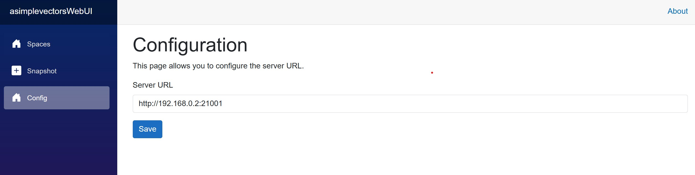
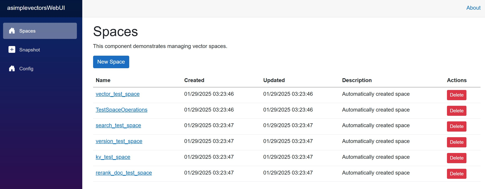
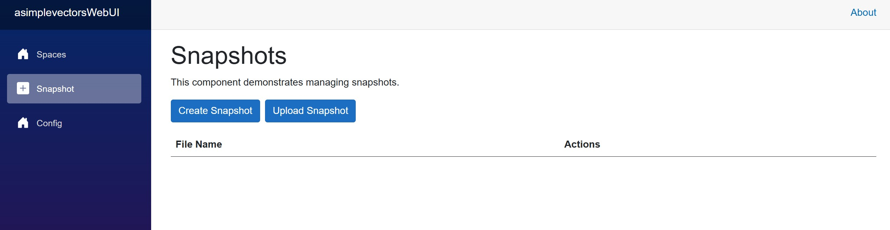

# asimplevectors WebUI

This is the WebUI for asimplevectors.

## About asimplevectors

[asimplevectors](https://docs.asimplevectors.com/) is a high-performance vector database optimized for retrieval-augmented generation (RAG) vector database. It provides fast and reliable clustering through Rust and the Raft consensus protocol, while leveraging SQLite3 for easy data management. Additionally, the database includes built-in key-value storage for managing original document data within the vector database.

## Quick Start
To download the latest version of the asimplevectors Docker image, use the following
```bash
mkdir -p $(pwd)/data
docker pull billionvectors/asimplevectors_webui:latest
docker run -v $(pwd)/data:/data -p 21080:8080 billionvectors/asimplevectors_webui:latest
```

## Quick Start with Docker Compose
To run both the WebUI and asimplevectors using Docker Compose, try a `docker-compose.yml` file with the following content:
```bash
docker-compose up
```

## Build without Docker

### Install Dependencies

After installing asimplevectors, run the following script to install the necessary dependencies:

```bash
./install_dependency.sh
```

## Install asimplevectors from Docker
To download the latest version of the asimplevectors Docker image, use the following
```bash
mkdir -p $(pwd)/data
docker pull billionvectors/asimplevectors:latest
docker run -v $(pwd)/data:/app/data -e ATV_STANDALONE=true -p 21001:21001 -p 21002:21002 billionvectors/asimplevectors:latest
```

## Running the WebUI

Run `./run_webui.sh` to start the WebUI on port 21080.

## How To Use

### Configuration


- Set the server URL.

### Space Management


- Manage spaces.

### Snapshot Management


- Manage snapshots.

If you want to test with sample data, upload the file [docs/snapshot-202501291224.zip](docs/snapshot-202501291224.zip) to the snapshot tab.

